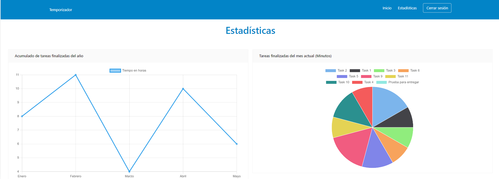

# README

Este README da una breve explicación de la evaluación asi como la puesta en marcha de la aplicación.

# Repositorio de evaluación

Este repositorio fue hecho con la finalidad de ayudar en el proceso de evaluación para la vacante de desarrollador Frontend.

### Principales Librerias y Framewoks Usados.

**React**: Por requerimientos de la evaluación, por lo que el proyecto esta desarrollado en base a esta biblioteca de JS.

**Nextjs**: Es un framework para react que nos facilita mucho la estructura, rendimiento, ruteo y la puesta en marcha de nuestro proyecto.
[**https://nextjs.org/docs/getting-started**](https://nextjs.org/docs/getting-started)

**Typescript**: Nos brinda a nuestro proyecto un mejor orden en cuestion de tipado y detectar rapidamente errores en nuestro editor.

**Tailwind**: Nos ofrece un repositorio repleto de clases CSS, que por consiguiente nos permite diseñar componentes web personalizados. Por estas ventajas se descritas se incluyó en el proyecto.

**Ant Design**: Es un lenguaje de diseño de interfaces y contiene una biblioteca React UI muy amplia.

**lint**: Es una herramienta de programación, que nos permite detectar código malicioso, confuso e incompatible entre distintas arquitecturas. Más explicitamente nos permite detectar errores de programación que solemos producir.

**chartjs**: Esta libreria nos permitio desarrollar las graficas para las estadísticas, ofrece interacción con las graficas, asi como animación.

**Prettier**: Lo que ofrece esta herramienta es tomar nuestro codigo y re-formatearlo en base a las configuraciones definitas en el archivo .prettierrc.js

**HarperDB**: Lo incluimos como base de datos y desarrollo de las API´s, HarperDB nos permite consultar datos mediante SQL o NoSQL y también tiene una API integrada, por lo que se adapta al desarrollo backend para este proyecto.
[**https://harperdb.io/**](https://harperdb.io/)

### Requisitos

**Nodejs**: Se probó con la versión 16.14.0 y 18.1.0, sino cuenta con alguno, se sugiere usar NVM para usar multiples versiones.

**NPM**: Se probó con la versión 8.6.0 y 8.8.0

### Instalación

1.- Clone el repositorio

```
git clone https://github.com/kevbrygil/task-timer-app.git
```

2.- Dirijase a la raiz del proyecto e instale la paqueria

```
cd task-timer-app/
git clone https://github.com/kevbrygil/task-timer-app.git
```

3.- Cree un archivo .env en la raiz del proyecto y dentro de ella agregar la llave proporcionado por el administrador

```
HARPERDB_PW=****Llave****
```

4.- Ejecute la app

```
npm run dev
```

5.- Acceder al sitio localmente

```
http://localhost:3000/
```

6.- Iniciar sesión o registrarse
Puedes iniciar sesión con el usuario por defecto(Proporcionado por el administrador), este usuario contiene información, por lo que serviría para probar.

### Explicación de la interfaz

#### Pantalla inicio

Desde aqui puedes accedes a registrarse o a iniciar sesión


#### Pantalla de registro

Aqui puedes registrarse nuevos usuarios, esto se almacena en la base de datos y por consiguiente inicia sesión automaticamente.


#### Pantalla de login

El sistema de autentificación que se implemento es "stateless" - Esto se significa que no se almacenará en la base de datos o en el servidor, que nos indique quién está conectado o no. Solamente almacena en el cliente un JWT de acceso para autentificar a los usuarios.


#### Pantalla de logueado


#### Pantalla con el temporizador

Aqui se pueden crear nuevas tareas e iniciarlas, tambien puedes sumar tiempo a las tareas
Basta indicar los siguientes puntos para esta pantalla:

-   El usuario puede crear tareas
-   Las tareas tienen 2 estados "Activo" y "Finalizado"
-   Cabe mencionar que por tiempo no se pudo clasicar las tareas como "Corta", "Mediana" y "Larga"
-   Solamente las tareas con estado "Activo" se muestran en el selector de tareas
-   Cuando le das al boton de "Acumular tiempo" a la tarea, este hace una suma al tiempo que tenias anteriormente
-   Solamente las tareas con estado "Activo" puedes sumar tiempo


#### Pantalla de estadisticas

Consta de 2 gráficas:
1- Es un acumulado de tiempo de las tareas finalizadas, estan agrupadas por mes y el año actual
2- Muestra una grafica tipo Pie con todas las tareas del mes actual

Tambien consta de una tabla con el histórico de las tareas con las siguientes características:

-   En un principio se muestran las tareas Finalizadas
-   Se puede filtrar por estado para mostrar las tareas activas/finalizadas
-   Se puede modificar el nombre de la tarea
-   Puedes ordenar los datos por los diferentes columnas
-   Puedes Eliminar una tarea
-   Puedes Finalizar una tarea





